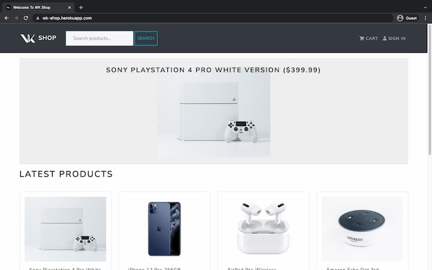
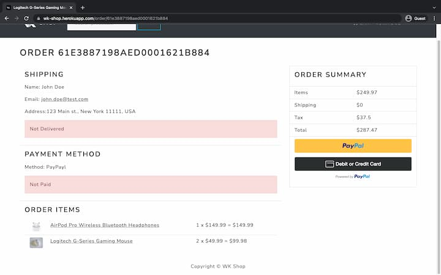
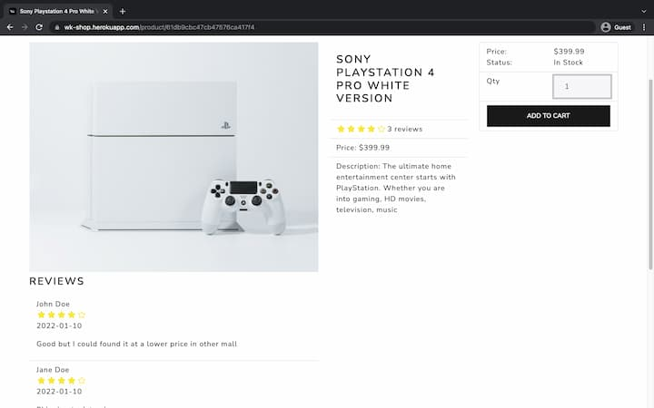
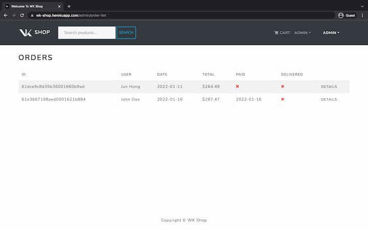
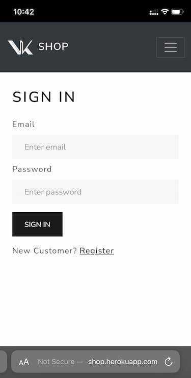
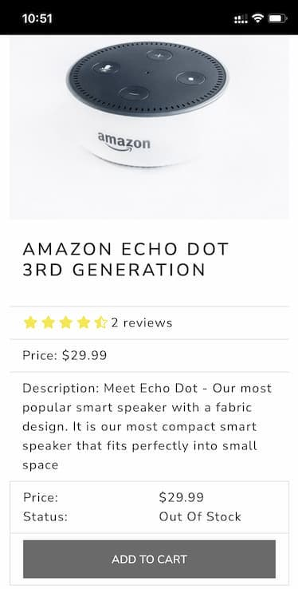

# WK Shop MERN Full-stack E-Commerce Application

This project is from O'Reilly eBook MERN e-commerce from scratch. Bug fixes, minor UI/UX modifications are added by myself. Backend is implemented with Node.js, Express, MongoDB. Frontend is powered by React.js, Redux and Bootstrap. 
> [Deployed Project Link](https://wk-shop.herokuapp.com)
  
> [YouTube Demo Link]()

> This application providers features below.

-   User Actions
    -   User registration/log-in using JSON Web Token (User authentication/authorization)
    -   User adds products into cart
    -   User purchases using PayPal payment system using PayPal Sandbox account
    -   User product review and rating

-   Admin Actions
    -   Admin tracks orders and marks delivered orders as complete
    -   Admin can add/edit/remove products
    -   Admin routes are protected by auth middleware

-   Product Search
-   Highlighted Products (based on product ratings)
- This application is fully responsive on mobile screens

## Available Scripts

To run a server `npm run start`  
To run a client `npm run client` 
To import base data to remote database `npm run data:import` 
To remove data in remote database `npm run data:destroy` 
Heroku build script `npm heroku-postbuild`

## Application Demo
